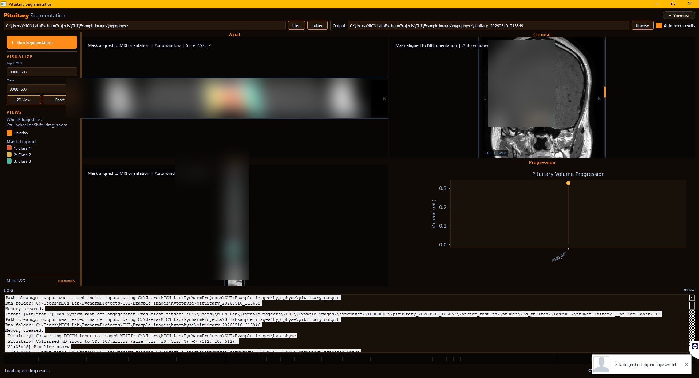

# Automated ZPS Grading

## ZPS Determination

`ZPS determination.ipynb` automatically computes the Zurich Pituitary Score from the segmentation of a pituitary adenoma and the cavernous segments of the internal carotid artery.

Reference:
https://radiopaedia.org/articles/zurich-pituitary-score

## Automated Segmentation

For generating the corresponding mask, trained nnU-Net models can be downloaded here:

https://owncloud.damutten.ch/s/zCbVKWkpILpABgW

To set up the nnU-Net environment, please consider the original repository:

https://github.com/MIC-DKFZ/nnUNet

## Graphical User Interface for Segmentation

The Pituitary GUI provides a focused workflow for selecting a pituitary MRI study, running the task-local nnU-Net segmentation model, and reviewing the resulting adenoma mask before ZPS grading.

## Citations

Da Mutten R, Zanier O, Bottini M, Baumann Y, Ciobanu-Caraus O, Regli L, Serra C, Staartjes VE. Fully automated grading of pituitary adenoma. *Neuroimage Rep.* 2025 Jan 29;5(1):100233. doi: 10.1016/j.y[...]

Raffaele Da Mutten, Olivier Zanier, Massimo Bottini, Yves Baumann, Olga Ciobanu-Caraus, Luca Regli, Carlo Serra, Victor Staartjes. Automatic Grading of the Zurich Pituitary Score: Using Semantic Segme[...]

